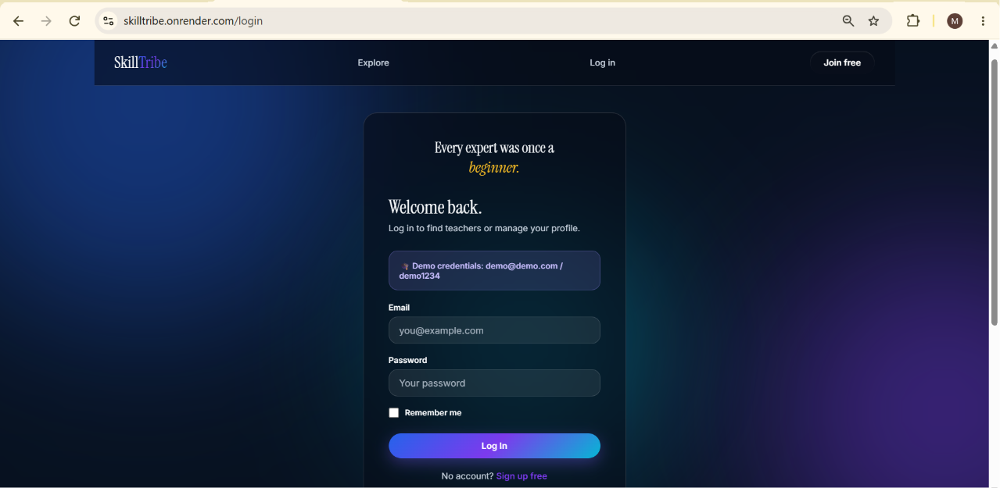
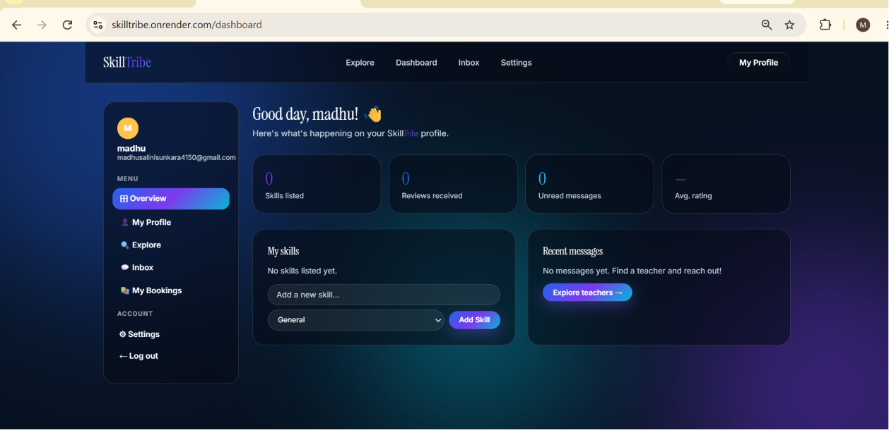
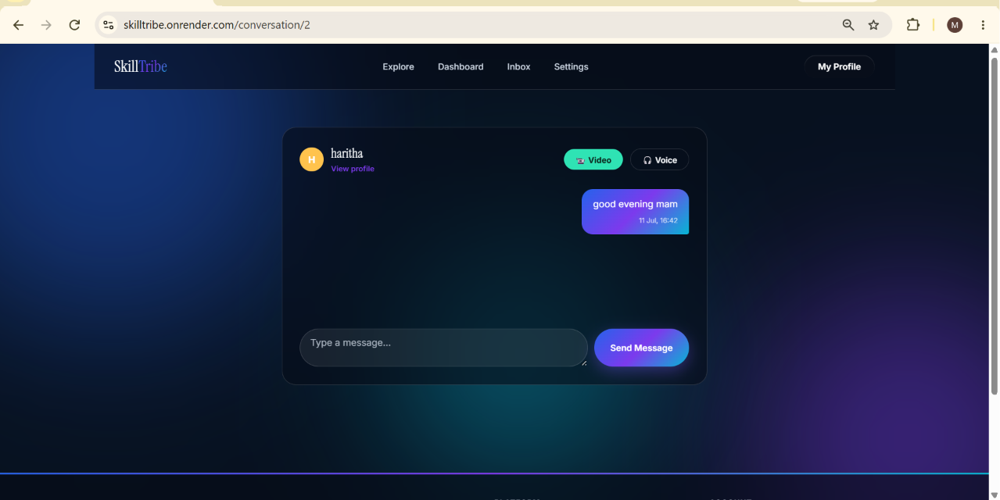

# 🚀 SkillTribe


SkillTribe is a modern skill-sharing platform where users can learn, teach, and connect with others.

🌐 Live Demo: https://skilltribe.onrender.com/

## ✨ Features

- 👤 User Authentication
- 🔒 Secure Login
- 💬 Real-time Chat
- 💳 Razorpay Payments
- 📤 File Uploads
- 📱 Responsive Design

## 🔐 Login Page



## 🏠 Dashboard



## 💬 Real-time Chat



## 🛠️ Tech Stack

### Frontend
- HTML
- CSS
- JavaScript

### Backend
- Python
- Flask
- Flask-SocketIO

### Database
- SQLite
- PostgreSQL

### Deployment
- Render
## 📁 Project Structure

```text
SkillTribe/
├── static/
├── templates/
├── uploads/
├── app.py
├── models.py
├── forms.py
├── config.py
├── wsgi.py
├── requirements.txt
└── README.md

## 👥 Contributors

- **Madhu Salini** - Developer
- **Sridivya** - Developer

## 📄 License

This project was developed for educational and portfolio purposes.

© 2026 Madhu Salini & Sridivya
